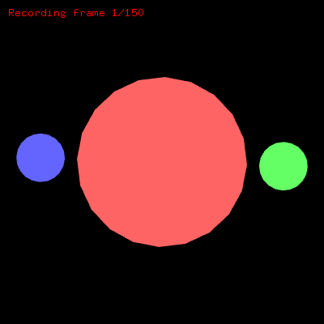

# FrameworkCanvas

> A complete openFrameworks digital art template with dual-mode video recording



FrameworkCanvas combines the power of openFrameworks with a streamlined make-based workflow, perfect for digital artists who want both interactive creativity and high-quality video output.

## ✨ Features

- **Dual-Mode Operation**: Switch between interactive app and video/GIF recording modes
- **Zero-Config Media Generation**: Frame-by-frame PNG export with automatic MP4/GIF creation
- **Multiple Output Formats**: Generate high-quality MP4 videos or web-friendly animated GIFs
- **Artist-Friendly Workflow**: Simple `make art` commands with preset formats
- **Neovim + Make Integration**: No Xcode required - pure terminal workflow
- **Customizable Output**: Configure resolution, framerate, duration, and quality
- **Self-Contained**: Everything managed through a single, powerful Makefile

## 🚀 Quick Start

```bash
# Clone and setup
git clone <your-repo>
cd FrameworkCanvas

# Interactive mode - opens a window for real-time creativity
make run

# Create a video - generates MP4 automatically
make art

# Create an animated GIF - perfect for web sharing
make gif

# Quick presets
make instagram # 1080x1080 Instagram feed post
make gif-web   # 800x600 optimized GIF  
make 4k        # 3840x2160 for high quality
make square    # 1080x1080 for general social media
```

## 🎨 Usage

### Basic Commands

```bash
make           # Build interactive .app
make run       # Build and run interactive app  
make video     # Create MP4 video (default settings)
make gif       # Create animated GIF (smaller, web-friendly)
make art       # Alias for 'make video'
make help      # Show complete usage guide
```

### Media Presets

**Instagram Optimized:**
```bash
make instagram         # 1080x1080 feed post (most common)
make instagram-story   # 1080x1920 stories & reels
make instagram-reel    # 1080x1920 reel format  
make instagram-portrait # 1080x1350 portrait post
```

**Video (MP4):**
```bash
make hd        # 1920x1080 @ 30fps
make 4k        # 3840x2160 @ 30fps  
make square    # 1080x1080 @ 30fps
make portrait  # 1080x1920 @ 30fps
```

**GIF (Optimized for Web):**
```bash
make gif-small           # 400x400 @ 15fps - tiny file size
make gif-web             # 800x600 @ 20fps - balanced quality/size
make gif-square          # 500x500 @ 24fps - social media ready
make gif-instagram-feed  # 1080x1080 @ 24fps - Instagram ready
make gif-instagram-story # 1080x1920 @ 24fps - Story format
```

### Custom Recording

```bash
# Override any video setting on the fly
make video VIDEO_WIDTH=2560 VIDEO_HEIGHT=1440 VIDEO_FPS=60 VIDEO_DURATION=15

# Custom GIF with specific settings
make gif VIDEO_WIDTH=600 VIDEO_HEIGHT=400 VIDEO_FPS=12 GIF_FILENAME=my_art.gif

# Custom filenames
make video VIDEO_FILENAME=my_artwork.mp4
make gif GIF_FILENAME=demo_animation.gif
```

## ⚙️ Configuration

Edit `config.make` to set your preferred defaults:

```make
# Output mode: "app" for interactive, "video" for recording
OUTPUT_TYPE = video

# Video settings
VIDEO_WIDTH = 1920
VIDEO_HEIGHT = 1080  
VIDEO_FPS = 30
VIDEO_DURATION = 10
VIDEO_FILENAME = output.mp4
GIF_FILENAME = output.gif

# FFmpeg path (if not in PATH)  
FFMPEG = ffmpeg
```

## 🛠️ Requirements

- **openFrameworks 0.12.1+** - [Download here](https://openframeworks.cc/download/)
- **Xcode Command Line Tools** - `xcode-select --install`
- **FFmpeg** - `brew install ffmpeg` (for video generation)
- **C++17 compatible compiler**

## 📁 Project Structure

```
FrameworkCanvas/
├── src/
│   ├── ofApp.h          # Main application header
│   ├── ofApp.cpp        # Application logic with video recording
│   └── main.cpp         # Entry point
├── config.make          # Project configuration
├── Makefile            # Self-contained build system
├── addons.make         # openFrameworks addons
└── README.md           # This file
```

## 🎥 How Media Generation Works

### Video (MP4)
1. **Frame Generation**: App runs in headless mode, saving each frame as PNG
2. **H.264 Encoding**: FFmpeg converts frames to high-quality MP4 with H.264 codec
3. **Cleanup**: Temporary frames are automatically removed
4. **Output**: Final video saved to project directory

### GIF Animation  
1. **Frame Generation**: Same PNG frame sequence as video
2. **Palette Optimization**: FFmpeg generates optimal color palette for better quality
3. **GIF Encoding**: Two-pass process creates smooth, web-optimized animated GIF
4. **Cleanup**: Temporary frames and palette files removed automatically

The demo animation features rotating colorful circles - perfect for testing or as a starting point for your own creations.

## 🎯 Interactive Mode Features

- **Real-time Preview**: See your art as you create it
- **Manual Recording**: Press 'r' to start recording anytime
- **Live Stats**: FPS counter and frame information
- **Responsive Controls**: Full mouse and keyboard support

## 🧹 Cleanup Commands

```bash
make clean-frames    # Remove temporary frame files
make clean-video     # Remove generated MP4s
make clean-gif       # Remove generated GIF files
make clean-all       # Clean everything (build + frames + videos + gifs)
```

## 🔧 Advanced Usage

### Environment Variables

The app reads these environment variables (set by Makefile):

- `OUTPUT_TYPE` - "app" or "video"
- `VIDEO_WIDTH` - Frame width in pixels
- `VIDEO_HEIGHT` - Frame height in pixels  
- `VIDEO_FPS` - Frames per second
- `VIDEO_DURATION` - Recording duration in seconds

### Custom Animation

Replace the demo animation in `src/ofApp.cpp` `draw()` method:

```cpp
void ofApp::draw(){
    // Your creative code here
    ofSetColor(255, 100, 200);
    ofDrawCircle(mouseX, mouseY, 50);
    
    // Video recording happens automatically
    if (isRecording) {
        saveFrame();
        frameCount++;
    }
}
```

## 🤝 Contributing

This is a template project designed to be forked and customized for your own digital art creations. Feel free to:

- Add new preset formats
- Extend the animation system
- Integrate additional openFrameworks addons
- Improve the build system

## 📄 License

This project is open source and available under the MIT License.

## 🙏 Credits

Built with [openFrameworks](https://openframeworks.cc/) - A creative coding toolkit.

Video encoding powered by [FFmpeg](https://ffmpeg.org/).